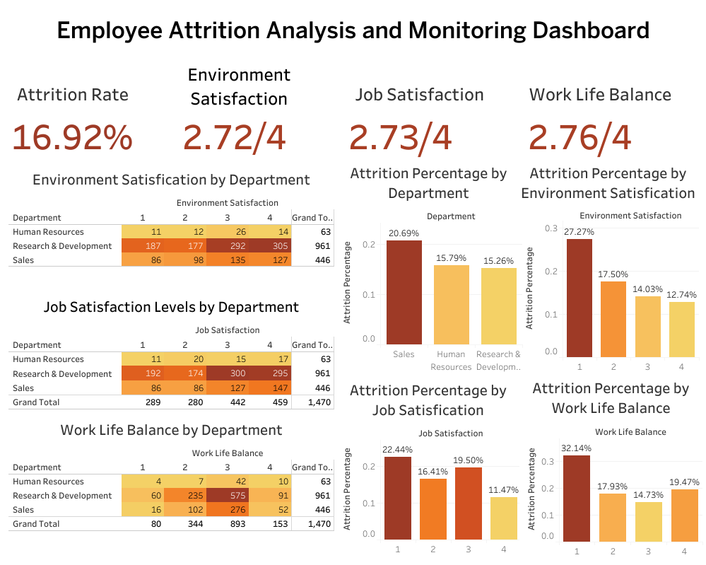

# Menyelesaikan Permasalahan Tingkat Attrition pada Perusahaan Jaya Jaya Maju

## Business Understanding

### Latar Belakang Bisnis
Jaya Jaya Maju adalah perusahaan multinasional yang telah beroperasi sejak tahun 2000, dengan lebih dari 1000 karyawan tersebar di berbagai lokasi. Walaupun tergolong perusahaan besar, Jaya Jaya Maju menghadapi tantangan signifikan dalam mengelola karyawannya, yang tercermin dari tingginya tingkat attrition (rasio jumlah karyawan yang keluar terhadap total karyawan keseluruhan). Saat ini, tingkat attrition perusahaan mencapai 16,92%, jauh di atas angka ideal untuk perusahaan dalam industri serupa.

Tingginya tingkat attrition tidak hanya menyebabkan meningkatnya biaya rekrutmen dan pelatihan tetapi juga dapat mempengaruhi produktivitas dan stabilitas organisasi secara keseluruhan. Oleh karena itu, manajer departemen HR meminta analisis mendalam untuk mengidentifikasi faktor-faktor yang memengaruhi attrition dan rekomendasi tindakan untuk menguranginya. Selain itu, sebuah business dashboard juga diminta untuk memantau faktor-faktor kunci yang memengaruhi tingkat attrition secara real-time.

---

## Permasalahan Bisnis
1. Identifikasi faktor-faktor utama yang memengaruhi tingkat attrition di perusahaan Jaya Jaya Maju.
2. Membangun model prediktif untuk mengidentifikasi karyawan yang berisiko tinggi meninggalkan perusahaan.
3. Mengembangkan business dashboard yang memberikan visualisasi interaktif untuk memonitor faktor-faktor yang berkontribusi terhadap attrition.

---

## Cakupan Proyek
Proyek ini akan mencakup beberapa langkah utama:
1. **Analisis data eksplorasi (EDA):** Memahami pola dan hubungan dalam data, serta mengeksplorasi faktor-faktor yang berkontribusi terhadap attrition.
2. **Preprocessing dan rekayasa fitur:** Membersihkan data, mengonversi fitur kategorikal menjadi numerik, normalisasi data, dan mengatasi ketidakseimbangan kelas.
3. **Pengembangan model prediktif:** Menggunakan algoritma machine learning untuk memprediksi karyawan yang berisiko tinggi keluar.
4. **Pembuatan business dashboard:** Menggunakan Tableau untuk menyajikan informasi kunci terkait tingkat attrition secara visual dan interaktif.
5. **Penyusunan rekomendasi berbasis data:** Memberikan saran strategis untuk mengurangi tingkat attrition.

---

## Persiapan

### Sumber Data
Dataset yang digunakan diambil dari repositori GitHub: [Employee Dataset](https://github.com/dicodingacademy/dicoding_dataset/tree/main/employee). Dataset ini berisi informasi terkait karyawan, seperti departemen, tingkat kepuasan kerja, keseimbangan kehidupan kerja, kepuasan lingkungan, dan atribut lainnya. Dataset ini memiliki berbagai fitur, seperti:

- **EmployeeId:** Identifikasi karyawan
- **Attrition:** Apakah karyawan meninggalkan perusahaan (0=no, 1=yes)
- **Age:** Usia karyawan
- **BusinessTravel:** Komitmen perjalanan untuk pekerjaan
- **DailyRate:** Gaji harian
- **Department:** Departemen tempat karyawan bekerja
- **DistanceFromHome:** Jarak dari rumah ke tempat kerja (dalam km)
- **Education:** Tingkat pendidikan karyawan (1 hingga 5)
- **EducationField:** Bidang pendidikan
- **EnvironmentSatisfaction:** Kepuasan lingkungan kerja (1-4)
- **Gender:** Jenis kelamin karyawan
- **HourlyRate:** Gaji per jam
- **JobInvolvement:** Tingkat keterlibatan pekerjaan (1-4)
- **JobLevel:** Tingkat jabatan (1 hingga 5)
- **JobRole:** Peran pekerjaan karyawan
- **JobSatisfaction:** Kepuasan kerja (1-4)
- **MaritalStatus:** Status pernikahan
- **MonthlyIncome:** Gaji bulanan
- **MonthlyRate:** Tarif bulanan
- **NumCompaniesWorked:** Jumlah perusahaan yang pernah bekerja di dalamnya
- **Over18:** Apakah karyawan berusia lebih dari 18 tahun
- **OverTime:** Apakah karyawan bekerja lembur
- **PercentSalaryHike:** Persentase kenaikan gaji tahun lalu
- **PerformanceRating:** Penilaian kinerja (1-4)
- **RelationshipSatisfaction:** Kepuasan hubungan kerja (1-4)
- **StandardHours:** Jam kerja standar
- **StockOptionLevel:** Level pilihan saham
- **TotalWorkingYears:** Total tahun bekerja
- **TrainingTimesLastYear:** Jumlah pelatihan yang diikuti tahun lalu
- **WorkLifeBalance:** Keseimbangan kehidupan kerja (1-4)
- **YearsAtCompany:** Lama bekerja di perusahaan
- **YearsInCurrentRole:** Lama bekerja di peran saat ini
- **YearsSinceLastPromotion:** Lama sejak promosi terakhir
- **YearsWithCurrManager:** Lama bekerja dengan manajer saat ini

### Setup Environment
#### 1. Instalasi Library
Pastikan library berikut telah terinstal:
```bash
pip install pandas numpy matplotlib seaborn scikit-learn xgboost imbalanced-learn joblib
```

#### 2. Setup Environment untuk Visualisasi Dashboard
Business dashboard dibuat menggunakan Tableau. Anda dapat mengunduh Tableau Public dari [situs resmi Tableau](https://public.tableau.com/). Data hasil preprocessing akan diekspor ke file CSV untuk diunggah ke Tableau.

---

## Analisis Data dan Model Prediktif

### Exploratory Data Analysis (EDA)
#### 1. Tingkat Attrition
Tingkat attrition perusahaan saat ini adalah **16,92%**, yang menunjukkan bahwa hampir 1 dari 6 karyawan meninggalkan perusahaan.

#### 2. Faktor Kepuasan Kerja
- **Environment Satisfaction:** Rata-rata tingkat kepuasan lingkungan adalah 2,72 dari 4. Karyawan dengan tingkat kepuasan 1 memiliki tingkat attrition tertinggi (27,27%).
- **Job Satisfaction:** Rata-rata kepuasan kerja adalah 2,73 dari 4. Karyawan dengan kepuasan kerja rendah (1) memiliki tingkat attrition sebesar 22,44%.
- **Work-Life Balance:** Rata-rata work-life balance adalah 2,76 dari 4. Karyawan dengan work-life balance rendah (1) memiliki tingkat attrition tertinggi sebesar 32,14%.

#### 3. Departemen dengan Tingkat Attrition Tinggi
- Departemen **Sales** memiliki tingkat attrition tertinggi (20,69%).
- Departemen **Human Resources** dan **R&D** memiliki tingkat attrition yang lebih rendah, masing-masing 15,79% dan 15,26%.

### Preprocessing dan Rekayasa Fitur
1. **Handling Missing Values:**
   - Menghapus baris dengan kolom `Attrition` yang kosong. Karena memiliki 28% nilai kosong, kita tidak bisa mengisi (imputasi) kolom Attrition ini tanpa risiko menambahkan bias signifikan. Dengan menghapus baris, kita memastikan hanya data lengkap yang digunakan.
2. **Encoding Categorical Features:**
   - Menggunakan `LabelEncoder` untuk mengonversi fitur kategorikal menjadi numerik.
3. **Scaling:**
   - Data dinormalisasi menggunakan `StandardScaler` untuk memastikan fitur berada pada skala yang sama.
4. **Mengatasi Ketidakseimbangan Kelas:**
   - Menggunakan SMOTE untuk oversampling kelas minoritas (attrition = 1) karena variabel target `Attrition` tidak seimbang,.

### Model Prediktif
Model yang digunakan:

| **Metrik**      | **Random Forest** | **XGBoost**   |
|-----------------|-------------------|---------------|
| **Accuracy**    | 91.48%            | 90.57%        |
| **Precision**   | 93.90%            | 92.73%        |
| **Recall**      | 88.41%            | 87.83%        |
| **F1-Score**    | 91.04%            | 90.31%        |

Hasil menunjukkan bahwa **Random Forest** memiliki performa terbaik dengan akurasi mencapai 91.48%.

---

## Business Dashboard
Dashboard ini memberikan visualisasi interaktif tentang faktor-faktor yang memengaruhi tingkat attrition, termasuk:
1. Tingkat kepuasan lingkungan.
2. Tingkat kepuasan kerja.
3. Keseimbangan kehidupan kerja.
4. Distribusi attrition berdasarkan departemen.

Dashboard dapat diakses melalui [link berikut](https://public.tableau.com/app/profile/deva.pratama/viz/EmployeeAttritionAnalysisandMonitoringDashboard/Dashboard1?publish=yes).



---

## Conclusion
Proyek ini berhasil mengidentifikasi faktor-faktor utama yang memengaruhi tingkat attrition di Jaya Jaya Maju, yaitu kepuasan lingkungan, kepuasan kerja, dan keseimbangan kehidupan kerja. Model prediktif yang dikembangkan menggunakan Random Forest dengan akurasi 91.48% dapat membantu perusahaan mengidentifikasi karyawan berisiko tinggi dengan akurasi yang baik. Dashboard yang dibuat menyediakan alat visualisasi untuk memantau faktor-faktor terjadinya attrition.

---

## Rekomendasi Action Items

1. **Meningkatkan Environment Satisfication:**  
   Renovasi ruang kerja dengan fokus pada kenyamanan, seperti pencahayaan yang baik dan ruang istirahat yang nyaman. Menyediakan fasilitas tambahan, seperti area hijau atau ruang rekreasi, dapat meningkatkan kesejahteraan fisik dan mental karyawan.

2. **Meningkatkan Job Satisfication:**  
   Adakan pelatihan keterampilan teknis dan soft skills untuk meningkatkan kompetensi karyawan. Memberikan jalur karier yang jelas dan peluang promosi juga penting untuk meningkatkan rasa keterlibatan dan loyalitas terhadap perusahaan.

3. **Meningkatkan Work-Life Balance:**  
   Tawarkan fleksibilitas jam kerja atau opsi kerja jarak jauh agar karyawan dapat mengatur keseimbangan antara pekerjaan dan kehidupan pribadi. Kebijakan cuti yang fleksibel juga dapat membantu mengurangi stres dan meningkatkan retensi.

4. **Fokus pada Departemen Sales:**  
   Lakukan survei internal untuk memahami tantangan spesifik di departemen Sales, seperti beban kerja atau dukungan atasan. Berdasarkan hasil survei, tingkatkan insentif, pelatihan, dan pengembangan untuk mengurangi attrition di departemen ini.  
